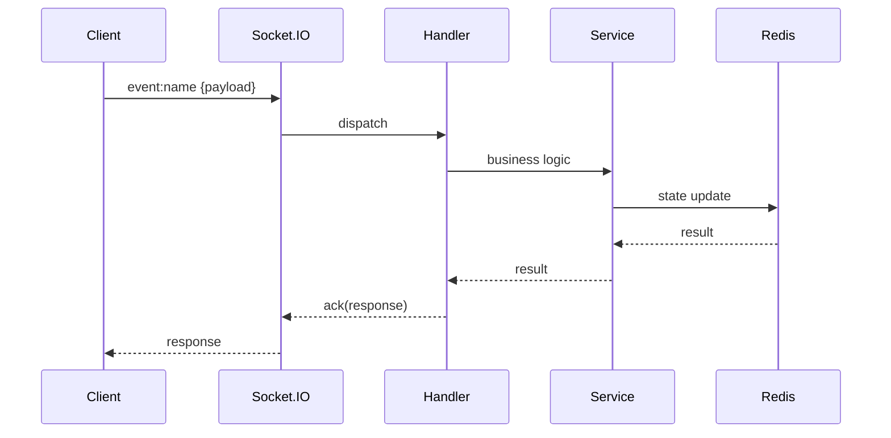

# MSAB Event Documentation Standard

> **Version**: 2.0  
> **Last Updated**: 2026-02-12  
> **Maintainer**: FlyLive Platform Team

This document defines the **official standard** for documenting Socket.IO events in the MSAB (MediaSoup Audio Broadcasting) server. All event documentation **MUST** follow this structure to ensure consistency, maintainability, and execution-level clarity.

---

## Table of Contents

1. [Philosophy](#philosophy)
2. [Document Structure](#document-structure)
3. [Section Requirements](#section-requirements)
4. [Formatting Rules](#formatting-rules)
5. [File Organization](#file-organization)
6. [Template](#template)
7. [Checklist](#checklist)

---

## Philosophy

### Core Principles

| Principle                    | Description                                                      |
| ---------------------------- | ---------------------------------------------------------------- |
| **Execution-Level Detail**   | Document the actual code execution path, not abstractions        |
| **Event-Driven Flow**        | Follow data from Socket.IO event to state change and broadcast   |
| **Handler-by-Handler**       | Reference specific handler files and line numbers where possible |
| **Cross-Platform Awareness** | Always show frontend and Laravel integration points              |
| **Real-Time State Focus**    | Document state transitions critical to real-time systems         |

### What This Documentation Is NOT

- ❌ A user-facing API reference
- ❌ High-level architecture documentation (see `Architecture/README.md`)
- ❌ Tutorial or getting-started guide
- ❌ Code comments replacement

### What This Documentation IS

- ✅ A developer's deep-dive into event handler implementation
- ✅ A maintenance guide for modifications
- ✅ A debugging reference for tracing issues
- ✅ An onboarding resource for understanding event flows
- ✅ A cross-platform integration reference

---

## Document Structure

### C→S Events (Client to Server)

Every C→S event documentation **MUST** contain these sections in order:

```
1.   Event Overview
2.   Event Contract (Schema + Payloads)
3.   Event Execution Flow (Handler Waterfall)
4.   State Transitions
5.   Reusability Matrix
6.   Error Handling & Edge Cases
7.   Sequence Diagram (Textual or Mermaid)
8.   Cross-Platform Integration (with TypeScript interfaces)
9.   Extension & Maintenance Notes
10.  Document Metadata (with Schema Change Log)
```

### S→C Events (Server to Client — Broadcasts)

For broadcast-only events, use the **lightweight broadcast template** (`BROADCAST_TEMPLATE.md`):

```
1.   Event Overview (triggered by, target)
2.   Event Payload (TypeScript interface + JSON + field table)
3.   Frontend Integration (listener + types)
4.   Trigger Source (link to C→S event)
5.   Error & Edge Cases
6.   Document Metadata
```

### Section Breakdown

| Section            | Purpose                                            | Level                              |
| ------------------ | -------------------------------------------------- | ---------------------------------- |
| Event Overview     | Context, responsibilities, domain ownership        | ✅ REQUIRED                        |
| Event Contract     | Zod schema, payloads, response format              | ✅ REQUIRED                        |
| Execution Flow     | Step-by-step handler code flow with ASCII diagrams | ✅ REQUIRED                        |
| State Transitions  | Redis/memory state changes                         | ⚡ REQUIRED if state changes exist |
| Reusability Matrix | Component reuse analysis                           | 📋 RECOMMENDED                     |
| Error Handling     | All possible errors and edge cases                 | ✅ REQUIRED                        |
| Sequence Diagram   | Textual or Mermaid sequence showing all actors     | ✅ REQUIRED                        |
| Cross-Platform     | Frontend + Laravel integration + TS interfaces     | ✅ REQUIRED                        |
| Extension Notes    | How to modify, what not to touch, pitfalls         | 📋 RECOMMENDED                     |
| Metadata           | Version, author, dates, schema change log          | ✅ REQUIRED                        |

> **Legend**: ✅ REQUIRED = Must be present. ⚡ REQUIRED (conditional) = Must be present when applicable. 📋 RECOMMENDED = Include for complex events, may be omitted for simple fire-and-forget events.

---

## Section Requirements

### 1. Event Overview

**Required elements:**

- Event Name (with direction indicator)
- Purpose (1-2 sentences)
- Domain (Room/Media/Seat/Chat/Gift/User)
- Responsibilities (bullet list)
- What It Owns (table)
- External Dependencies (table)

**Direction indicators:**

- `C→S` = Client to Server
- `S→C` = Server to Client
- `C↔S` = Bidirectional

**Example:**

```markdown
## 1. Event Overview

### Event: `room:join` (C→S)

### Purpose

Allows a client to join an audio room, receive RTP capabilities, and begin receiving participant updates.

### Domain

**Room** - Room lifecycle management

### Responsibilities

- Validate room exists (via Laravel or cache)
- Create/retrieve mediasoup router for room
- Add socket to Socket.IO room
- Track client in ClientManager
- Broadcast join to other participants

### What It Owns

| Owned           | Description                 |
| --------------- | --------------------------- |
| Room membership | Socket joins Socket.IO room |
| Client tracking | ClientManager entry created |

### External Dependencies

| Dependency    | Type           | Purpose                    |
| ------------- | -------------- | -------------------------- |
| Laravel API   | HTTP           | Room validation (optional) |
| Redis         | State          | Room state persistence     |
| WorkerManager | Infrastructure | Router allocation          |
```

---

### 2. Event Contract

**Required elements:**

- Event name
- Direction
- Acknowledgment (callback) support
- Zod schema (from `src/socket/schemas.ts`)
- Payload schema (JSON with comments)
- Field details (table)
- Response/ACK schemas
- Emitted events (broadcasts)

**Example:**

```markdown
## 2. Event Contract

### Inbound Event
```

Event: room:join
Direction: C→S
Acknowledgment: ✅ Required (callback)

````

### Zod Schema

```typescript
// src/socket/schemas.ts
export const joinRoomSchema = z.object({
  roomId: z.string(),
  ownerId: z.number().optional(), // Owner ID for verification
});
````

### Payload Schema

```json
{
  "roomId": "string", // Required, room identifier
  "ownerId": "number" // Optional, for ownership verification
}
```

### Field Details

| Field     | Type     | Required | Constraints  | Example        |
| --------- | -------- | -------- | ------------ | -------------- |
| `roomId`  | `string` | ✅       | min 1 char   | `"42"` or UUID |
| `ownerId` | `number` | ❌       | positive int | `1234`         |

### Acknowledgment Response

```json
// Success
{
  "rtpCapabilities": { /* mediasoup RTP capabilities */ },
  "participants": [{ "userId": 123, "name": "John" }],
  "producers": [{ "producerId": "uuid", "userId": 123 }],
  "seats": [{ "seatIndex": 0, "user": { "id": 123, "name": "John" } }],
  "ownerId": 1234
}

// Error
{
  "error": "Room not found"
}
```

### Emitted Events

| Event             | Target                  | When                  |
| ----------------- | ----------------------- | --------------------- |
| `room:userJoined` | Room (excluding sender) | After successful join |

```

---

### 3. Event Execution Flow

**Required subsections:**
- 3.1 Entry Point (event listener registration)
- 3.2 Schema Validation
- 3.3 Handler Logic
- 3.4 Service Layer Calls
- 3.5 State Updates
- 3.6 Broadcasts/Responses

**ASCII Diagram Requirements:**
- Use box-drawing characters for visual blocks
- Show file paths and line numbers
- Include code snippets for key operations
- Mark each step clearly

**Box Template:**

```

┌─────────────────────────────────────────────────────────────────────────────┐
│ SECTION TITLE │
│─────────────────────────────────────────────────────────────────────────────│
│ File: path/to/file.ts:line │
│ │
│ Description of what happens here │
│ │
│ ┌─────────────────────────────────────────────────────────────────────────┐ │
│ │ Code snippet or key operation │ │
│ └─────────────────────────────────────────────────────────────────────────┘ │
└─────────────────────────────────────────────────────────────────────────────┘

````

---

### 4. State Transitions

**Required elements:**
- State location (Redis key pattern / in-memory)
- Before state
- After state
- Rollback behavior (if applicable)

**Example:**

```markdown
## 4. State Transitions

### ClientManager (In-Memory)

| Property | Before | After |
|----------|--------|-------|
| `client.roomId` | `undefined` | `"42"` |
| `client.joinedAt` | `undefined` | `Date.now()` |

### Redis State

| Key Pattern | Operation | TTL |
|-------------|-----------|-----|
| `room:{roomId}:state` | GET/SET | None |
| `room:{roomId}:seats` | HGETALL | None |

### Socket.IO Room

| Room | Action |
|------|--------|
| `roomId` | `socket.join(roomId)` |
````

---

### 5. Reusability Matrix

**Required columns:**
| File | Used By Events | Reusable | Reasoning |

**Reusability indicators:**

- ✅ Reusable - Can be used by other events
- ❌ Single-purpose - Event-specific
- ⭕ Mixed/Partially - Some parts reusable

---

### 6. Error Handling & Edge Cases

**Required subsections:**

- Validation Errors (schema failures)
- Business Logic Errors
- System Errors
- Edge Cases

**Table format:**
| Error | Source | Condition | Client Receives |

---

### 7. Sequence Diagram (Textual or Mermaid)

**Required actors for MSAB:**

- CLIENT
- SOCKET.IO
- HANDLER
- SERVICE/MANAGER
- REDIS/MEDIASOUP
- LARAVEL (if applicable)

**Format (ASCII — default):**

```
 CLIENT           SOCKET.IO          HANDLER            SERVICE            REDIS/MEDIASOUP
   │                  │                  │                  │                     │
   │  event:name      │                  │                  │                     │
   │─────────────────▶│                  │                  │                     │
   │                  │ 1. validate      │                  │                     │
   │                  │─────────────────▶│                  │                     │
   │                  │                  │ 2. call service  │                     │
   │                  │                  │─────────────────▶│                     │
   │                  │                  │                  │ 3. state update     │
   │                  │                  │                  │────────────────────▶│
```

**Format (Mermaid — optional alternative):**



> **Note**: Either ASCII or Mermaid is acceptable. ASCII is universally portable; Mermaid renders natively on GitHub. Pick one per document, do not mix both.

---

### 8. Cross-Platform Integration

**Required subsections:**

- Frontend Usage (Nuxt/Vue) with **TypeScript interfaces** for payloads
- Laravel Integration (if any)
- Related Events

**TypeScript interfaces** should define the exact shape of:

- Inbound payload (what the client sends)
- ACK response (what the client receives)
- Broadcast payloads (what listeners receive)

See the [Frontend Integration Guide](Integrations/NUXT_CLIENT.md) for the central reference.

**Example:**

````markdown
## 8. Cross-Platform Integration

### Frontend Usage (Nuxt)

```typescript
// composables/useRoom.ts
const joinRoom = async (roomId: string) => {
  const response = await socket.emitWithAck("room:join", { roomId });
  if (response.error) throw new Error(response.error);
  return response;
};
```
````

### Laravel Integration

| Endpoint                   | When Called | Purpose                       |
| -------------------------- | ----------- | ----------------------------- |
| `GET /internal/rooms/{id}` | On join     | Verify room exists, get owner |

### Related Events

| Event              | Relationship           |
| ------------------ | ---------------------- |
| `room:leave`       | Inverse operation      |
| `room:userJoined`  | Broadcast after this   |
| `transport:create` | Typically follows this |

```

---

### 9. Extension & Maintenance Notes

**Required subsections:**
- ✅ Where to Add New Features
- 📝 Modification Guide
- ⚠️ What Should NOT Be Modified Casually
- 🚨 Common Pitfalls
- 📁 File Locations Quick Reference

---

### 10. Document Metadata

**Required fields:**

| Property | Value |
|----------|-------|
| **Event** | `event:name` |
| **Domain** | Domain name |
| **Direction** | C→S / S→C / C↔S |
| **Author** | Author or "System Documentation" |
| **Created** | YYYY-MM-DD |
| **Last Updated** | YYYY-MM-DD |
| **Node.js Version** | ≥22.0.0 |
| **TypeScript Version** | ^5.7.0 |

**Schema Change Log (REQUIRED):**

Track all schema changes to communicate breaking/non-breaking changes across teams.

| Date       | Change                           | Breaking | Migration Notes |
|------------|----------------------------------|----------|-----------------|
| YYYY-MM-DD | Initial schema                   | —        | —               |
| YYYY-MM-DD | Added `fieldName` to payload     | No       | Optional field  |
| YYYY-MM-DD | Changed `fieldName` type         | Yes      | Update clients  |

---

## Formatting Rules

### Markdown Standards

1. **Headers**: Use `##` for main sections, `###` for subsections
2. **Tables**: Use GitHub-style markdown tables
3. **Code blocks**: Use triple backticks with language identifier
4. **Emphasis**: Use `**bold**` for key terms, `*italic*` for emphasis
5. **Inline code**: Use backticks for file names, class names, methods

### Visual Elements

1. **ASCII Diagrams**: Use box-drawing characters (┌ ─ ┐ │ └ ┘ ├ ┤ ┬ ┴ ┼)
2. **Mermaid Diagrams**: Accepted as alternative to ASCII for sequence diagrams
3. **Arrows**: Use → for inline, ─▶ for diagrams
4. **Emojis**: Use sparingly for section icons (✅ ❌ ⚠️ 📝 🔗 📋 🚨 📁)
5. **Horizontal rules**: Use `---` to separate major sections

### Code Snippet Rules

1. Include file path and **function/class names** for traceability (line numbers optional — they drift with code changes)
2. Show only relevant code, use `// ...` for omissions
3. Add inline comments explaining key operations
4. Use proper syntax highlighting (`typescript`, `json`)

---

## File Organization

### Directory Structure

```

docs/
├── DOCUMENTATION_STANDARD.md ← This file
├── TEMPLATE.md ← C→S event template
├── BROADCAST_TEMPLATE.md ← S→C broadcast event template
│
├── Architecture/
│ └── README.md ← System overview
│
├── Events/
│ ├── Room/ ← C→S events
│ │ ├── join/README.md
│ │ └── leave/README.md
│ ├── Media/
│ │ ├── transport-create/README.md
│ │ ├── transport-connect/README.md
│ │ ├── audio-produce/README.md
│ │ ├── audio-consume/README.md
│ │ └── consumer-resume/README.md
│ ├── Seat/
│ │ ├── take/README.md
│ │ └── ... (12 total)
│ ├── Chat/
│ │ └── message/README.md
│ ├── Gift/
│ │ ├── send/README.md
│ │ └── prepare/README.md
│ ├── User/
│ │ └── get-room/README.md
│ └── Server/ ← S→C broadcast events
│ ├── room-userJoined/README.md
│ ├── seat-updated/README.md
│ ├── gift-received/README.md
│ └── ... (13 total)
│
├── Integrations/
│ ├── LARAVEL.md ← HTTP API + Pub/Sub contracts
│ └── NUXT_CLIENT.md ← Frontend integration guide
│
└── Old ( Deprecated )/ ← Legacy docs (reference only)

```

### Naming Conventions

| Item | Convention | Example |
|------|------------|---------|
| Domain folder | PascalCase | `Room/`, `Media/`, `Seat/` |
| Event folder | kebab-case | `room-join/`, `transport-create/` |
| Documentation file | Always `README.md` | `docs/Events/Room/join/README.md` |

---

## Templates

Two templates are available:

| Template                 | Use For          | Location             |
|--------------------------|------------------|----------------------|
| **C→S Event Template**   | Client→Server events | `docs/TEMPLATE.md` |
| **Broadcast Template**   | Server→Client broadcasts | `docs/BROADCAST_TEMPLATE.md` |

Copy the appropriate template when starting new event documentation.

---

## Checklist

Use this checklist when creating new event documentation:

### Before Starting

- [ ] Identify the handler file(s) involved
- [ ] Trace the execution flow from event to response/broadcast
- [ ] Identify all state changes (Redis, in-memory, Socket.IO rooms)
- [ ] Review existing similar event documentation for patterns

### Section Checklist

- [ ] Event Overview complete with tables
- [ ] Event Contract with Zod schema and all payloads
- [ ] Execution Flow with ASCII diagrams for all steps
- [ ] State Transitions documented
- [ ] Reusability Matrix complete
- [ ] All error types documented
- [ ] Sequence diagram with numbered steps
- [ ] Cross-Platform Integration documented
- [ ] Extension Notes included
- [ ] Metadata filled in

### Quality Checks

- [ ] All file paths are correct and exist
- [ ] Code snippets are accurate
- [ ] No placeholder text remaining
- [ ] All tables are properly formatted
- [ ] ASCII diagrams render correctly
- [ ] Markdown links work

---

## Version History

| Version | Date | Author | Changes |
|---------|------|--------|---------|
| 2.0 | 2026-02-12 | System | Added Required/Recommended tiers, S→C broadcast template, TypeScript interface requirements, Schema Change Log, Mermaid diagram option, NUXT_CLIENT.md reference |
| 1.0 | 2026-02-09 | System | Initial standard created |
```
