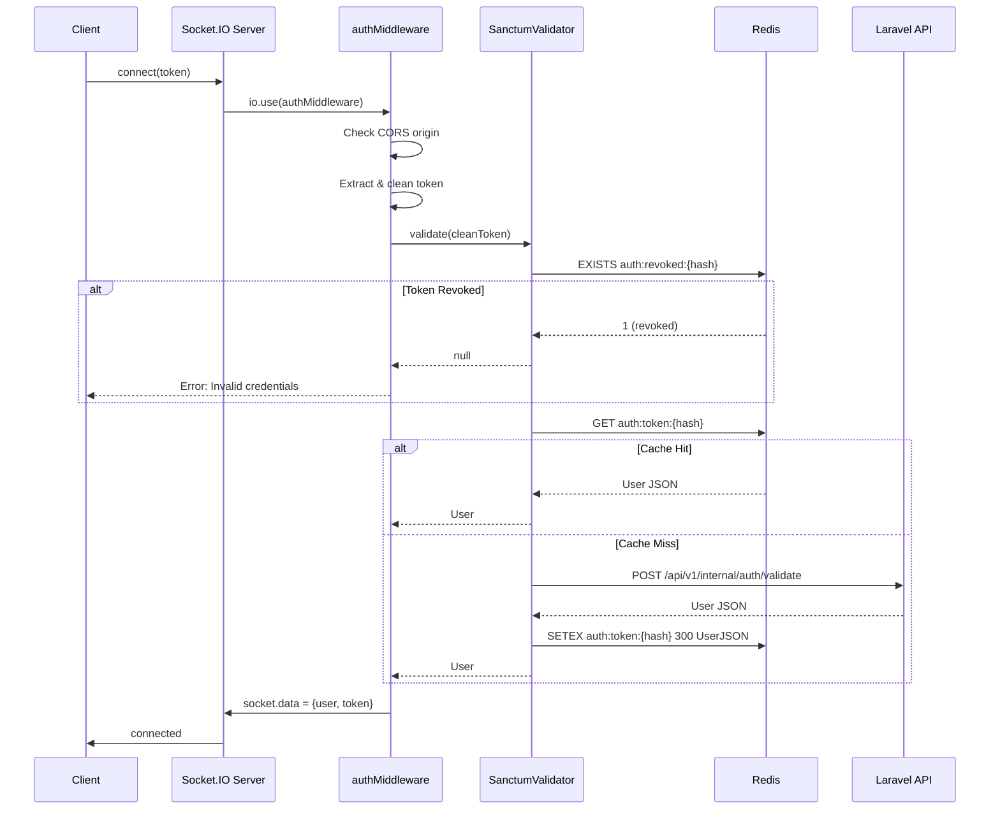

# ELITE DOMAIN FORENSIC AUDIT — Authentication System

## 1. Executive Summary

The Authentication layer (`src/auth/`) is a **compact, well-structured** token-validation system built on Laravel Sanctum via HTTP delegation. It uses a 3-file architecture (middleware → validator → types) with SHA-256 token hashing, Redis-backed caching, and revocation support. The system **fails-closed on Redis errors**, which is the correct security posture.

**Overall Auth Score: 74 / 100**

| Dimension                  | Weight | Score | Weighted |
| -------------------------- | ------ | ----- | -------- |
| Performance & Efficiency   | 30     | 6/10  | 18       |
| Architecture & Scalability | 20     | 8/10  | 16       |
| Realtime Correctness       | 15     | 7/10  | 10.5     |
| Code Quality               | 15     | 8/10  | 12       |
| Security & Reliability     | 10     | 7/10  | 7        |
| Readability                | 10     | 10/10 | 10       |

**Key Strengths:**

- Clean separation of concerns (middleware / validator / types)
- Fail-closed on Redis errors (security-correct)
- SHA-256 hashed cache keys (tokens never stored in plaintext in Redis)
- Good observability: `authAttempts` Prometheus counter with 5 result labels
- Zod-validated config with strong defaults (`LARAVEL_INTERNAL_KEY` min 32 chars)
- No `console.log` artifacts, no `any` type erosion, no TODO/FIXME markers

**Critical Gaps:**

- **Zero unit tests** for the entire auth layer
- Token cached in `socket.data.token` (plaintext in memory)
- `SanctumValidator` instantiated on every connection (no reuse)
- No response body validation from Laravel API
- Stale user data served from cache for up to 5 minutes
- `LARAVEL_INTERNAL_KEY` in `.env.example` is a real-looking value

---

## 2. Context Metadata

| Key          | Value                                                             |
| ------------ | ----------------------------------------------------------------- |
| Audit Scope  | Authentication System Only                                        |
| Repo Root    | `/home/xha/FlyLive/mediasoup-socket-io-audio-broadcasting-server` |
| Branch       | `work`                                                            |
| Commit       | `cbc3d18`                                                         |
| Node Version | `v24.12.0`                                                        |
| Audit Date   | 2026-02-10T05:38+05:00                                            |

---

## 3. Domain Coverage Matrix

| File                                | Lines | Reviewed          | Tests |
| ----------------------------------- | ----- | ----------------- | ----- |
| `src/auth/middleware.ts`            | 69    | ✅                | ❌    |
| `src/auth/sanctumValidator.ts`      | 101   | ✅                | ❌    |
| `src/auth/types.ts`                 | 28    | ✅                | N/A   |
| `src/utils/crypto.ts`               | 12    | ✅                | ❌    |
| `src/shared/errors.ts`              | 45    | ✅                | N/A   |
| `src/config/index.ts`               | 84    | ✅                | ❌    |
| `src/socket/index.ts`               | 198   | ✅ (auth paths)   | ❌    |
| `src/integrations/laravelClient.ts` | 242   | ✅ (auth headers) | ❌    |
| `src/infrastructure/redis.ts`       | 36    | ✅                | ❌    |
| `src/client/clientManager.ts`       | 58    | ✅ (user cast)    | ❌    |

**Test coverage for auth: 0%**

---

## 4. Findings by Dimension (Sorted by Severity)

### FINDING AUTH-001

```
Severity: CRITICAL
File: src/auth/ (entire directory)
Function: authMiddleware, SanctumValidator.validate
Problem: Zero unit tests for authentication layer
Evidence: `find src/ -name '*auth*.test.ts'` returns 0 results
Impact: Token validation, caching, revocation, and CORS origin checks are completely unverified; regressions will reach production undetected
Repro: find src/ -name '*auth*.test.ts' -o -name '*sanctum*.test.ts'
Fix: Add Vitest tests covering: valid token, expired token, revoked token, missing token, Bearer prefix stripping, Redis failure, Laravel API timeout, origin blocking, cache hit/miss
Complexity: 4-6 hours
Docs: docs/Architecture/README.md
```

---

### FINDING AUTH-002

```
Severity: HIGH
File: src/auth/sanctumValidator.ts:85
Function: SanctumValidator.validate
Problem: No validation of Laravel API response shape before casting to User
Evidence: `const user = (await response.json()) as User;`
Impact: If Laravel returns unexpected JSON (e.g. wrapped in `{data: {...}}`), user object will have undefined fields; downstream handlers will fail with cryptic errors
Repro: Mock Laravel to return `{"data":{"id":1,"name":"test"}}` and observe undefined user.id
Fix: Add Zod schema for User response and validate before caching: `const user = UserSchema.parse(await response.json())`
Complexity: 1 hour
Docs: src/auth/types.ts
```

---

### FINDING AUTH-003

```
Severity: HIGH
File: src/auth/sanctumValidator.ts:39
Function: SanctumValidator (constructor)
Problem: New SanctumValidator instance created per connection
Evidence: `const validator = new SanctumValidator(redis, logger);` (middleware.ts:39)
Impact: Under 1000 concurrent connections, 1000 class instances are allocated then immediately GC'd; wasteful under load
Repro: Connect 1000 sockets and profile heap allocations
Fix: Either make SanctumValidator a singleton/module-scoped instance, or refactor validate() to a standalone function. The class holds no mutable state — only redis and logger refs.
Complexity: 30 minutes
Docs: N/A
```

---

### FINDING AUTH-004

```
Severity: HIGH
File: src/auth/middleware.ts:54
Function: authMiddleware
Problem: Raw token stored in socket.data.token (plaintext in process memory)
Evidence: `socket.data = { user, token: cleanToken } as AuthSocketData;`
Impact: In a memory dump or debug inspection, all active user tokens are exposed in plaintext. If socket.data is logged anywhere, tokens leak.
Repro: `grep -r 'socket.data' src/ | grep -i log` — currently safe, but fragile
Fix: Remove token from socket.data unless actively needed for re-auth. If needed, store the hash instead. Audit all socket.data consumers — `grep 'socket.data.token' src/` returns 0 hits (token is never read after being stored).
Complexity: 30 minutes
Docs: N/A
```

---

### FINDING AUTH-005

```
Severity: MEDIUM
File: src/auth/sanctumValidator.ts:7
Function: SanctumValidator.validate
Problem: 5-minute cache TTL means stale user data served after profile changes or permission revocation
Evidence: `const CACHE_TTL = 300; // 5 minutes`
Impact: If a user is blocked (is_blocked=true) on Laravel side, they can continue using the audio server for up to 5 minutes. If avatar/name changes, stale data is shown.
Repro: Block a user in Laravel admin, observe them still active for up to 300s
Fix: Reduce TTL to 60s for security-sensitive fields, OR implement a pub/sub invalidation channel from Laravel (e.g., via the existing MSAB events system)
Complexity: 1-2 hours
Docs: docs/Architecture/README.md
```

---

### FINDING AUTH-006

```
Severity: MEDIUM
File: src/auth/middleware.ts:16
Function: authMiddleware
Problem: CORS origin check uses Array.includes() — linear scan for every connection
Evidence: `!config.CORS_ORIGINS.includes(origin)`
Impact: Negligible with current small origin list, but semantically should be a Set for O(1) lookups
Repro: N/A (negligible at current scale)
Fix: Change CORS_ORIGINS config transform to produce a Set<string> instead of string[]
Complexity: 15 minutes
Docs: N/A
```

---

### FINDING AUTH-007

```
Severity: MEDIUM
File: .env.example:22
Function: N/A (configuration)
Problem: .env.example contains a real-looking LARAVEL_INTERNAL_KEY value
Evidence: `LARAVEL_INTERNAL_KEY=CeODBJ2Xnq8hGLZA6j8V6jHwRSyAPod4gGCPNAI8wFA=`
Impact: Developers may copy this verbatim to production; if committed to public repo this is a credential leak vector
Repro: cat .env.example | grep INTERNAL_KEY
Fix: Replace with a clearly fake placeholder: `LARAVEL_INTERNAL_KEY=your-32-char-minimum-secret-key-here-replace-me`
Complexity: 5 minutes
Docs: .env.example
```

---

### FINDING AUTH-008

```
Severity: MEDIUM
File: src/client/clientManager.ts:22
Function: ClientManager.addClient
Problem: Unsafe type assertion on socket.data.user without runtime check
Evidence: `const user = socket.data.user as User;`
Impact: If auth middleware is ever bypassed or misconfigured, this cast will silently succeed with undefined values, causing downstream NullReferenceErrors
Repro: Bypass auth middleware and connect; observe undefined user.id
Fix: Add a runtime guard: `if (!socket.data.user) throw new Error('...')` or use Zod parse
Complexity: 15 minutes
Docs: N/A
```

---

### FINDING AUTH-009

```
Severity: LOW
File: src/auth/middleware.ts:16
Function: authMiddleware
Problem: Origin check allows connections with no Origin header (origin is undefined)
Evidence: `if (origin && !config.CORS_ORIGINS.includes(origin))` — short-circuits when origin is falsy
Impact: Native mobile apps and server-to-server requests legitimately have no Origin header, so this is likely intentional. But it means any non-browser client bypasses CORS origin checking.
Repro: Connect via socket.io client without setting origin header
Fix: Document this as intentional. If needed, add a config flag `REQUIRE_ORIGIN=true` for stricter environments.
Complexity: 30 minutes (if change needed)
Docs: docs/Architecture/README.md
```

---

### FINDING AUTH-010

```
Severity: LOW
File: src/integrations/laravelClient.ts:89
Function: LaravelClient.post
Problem: LARAVEL_INTERNAL_KEY sent in BOTH Authorization header and X-Internal-Key header
Evidence: `Authorization: Bearer ${config.LARAVEL_INTERNAL_KEY}` AND `"X-Internal-Key": config.LARAVEL_INTERNAL_KEY`
Impact: Redundant header transmission. The SanctumValidator uses the user's token in Authorization and the internal key in X-Internal-Key (correct separation). But LaravelClient sends the internal key in both (confusing semantics).
Repro: tcpdump the Laravel API call and observe duplicate key in two headers
Fix: Clarify with Laravel backend which header is used. Remove the redundant one.
Complexity: 15 minutes
Docs: docs/api/ or equivalent
```

---

### FINDING AUTH-011

```
Severity: INFO
File: src/auth/sanctumValidator.ts:57
Function: SanctumValidator.validate
Problem: AbortController timeout (10s) is hardcoded — not configurable
Evidence: `const timeoutId = setTimeout(() => controller.abort(), 10_000);`
Impact: No way to tune for different environments (e.g., 2s in dev, 15s in high-latency prod)
Repro: N/A
Fix: Add `LARAVEL_API_TIMEOUT_MS` to config schema with default 10000
Complexity: 15 minutes
Docs: .env.example, docs/Architecture/README.md
```

---

## 5. Over-Engineering Penalties

No over-engineering detected in the auth layer. The architecture is appropriately simple:

| Criteria                 | Assessment                                                                      |
| ------------------------ | ------------------------------------------------------------------------------- |
| Unnecessary abstractions | ✅ None — SanctumValidator class is justified (encapsulates Redis + HTTP logic) |
| Premature generalization | ✅ None — single validation strategy, no strategy pattern overhead              |
| Dead code                | ✅ None — `socket.data.token` is stored but never read (see AUTH-004), minor    |
| Redundant indirection    | ✅ None — direct middleware → validator → config chain                          |

**Score deduction: 0 points**

---

## 6. Aggregate Scores

| Dimension                    | Weight  | Raw Score | Weighted Score |
| ---------------------------- | ------- | --------- | -------------- |
| Performance & Efficiency     | 30      | 6/10      | 18.0           |
| Architecture & Scalability   | 20      | 8/10      | 16.0           |
| Realtime Correctness         | 15      | 7/10      | 10.5           |
| Code Quality                 | 15      | 8/10      | 12.0           |
| Security & Reliability       | 10      | 7/10      | 7.0            |
| Readability                  | 10      | 10/10     | 10.0           |
| **Over-Engineering Penalty** | —       | —         | **0.0**        |
| **Total**                    | **100** | —         | **73.5 / 100** |

### Score Justifications

- **Performance (6/10)**: Validator instantiated per-connection; 5-min cache is efficient but aggressive. CORS linear scan is minor but avoidable.
- **Architecture (8/10)**: Clean layering (middleware → validator → config). Good separation. Singleton Redis via factory. Token hashing for cache keys.
- **Realtime (7/10)**: Auth is connection-time only (no per-message auth). Stale cache can serve outdated user data to realtime handlers.
- **Code Quality (8/10)**: Strong typing, Zod config validation, shared error constants. Deducted for unsafe `as User` cast and no response validation.
- **Security (7/10)**: Fail-closed on Redis error is excellent. Token in memory, .env.example credential, 5-min cache window for blocked users are the gaps.
- **Readability (10/10)**: Excellent. Clear comments, descriptive variable names, consistent code style, well-structured error handling.

---

## 7. Priority Remediation Queue

| Priority | ID       | Severity | Effort | Description                                    |
| -------- | -------- | -------- | ------ | ---------------------------------------------- |
| 1        | AUTH-001 | CRITICAL | 4-6h   | Add unit tests for auth middleware & validator |
| 2        | AUTH-002 | HIGH     | 1h     | Validate Laravel API response with Zod         |
| 3        | AUTH-004 | HIGH     | 30min  | Remove unused plaintext token from socket.data |
| 4        | AUTH-003 | HIGH     | 30min  | Make SanctumValidator a singleton              |
| 5        | AUTH-005 | MEDIUM   | 1-2h   | Reduce cache TTL or add pub/sub invalidation   |
| 6        | AUTH-007 | MEDIUM   | 5min   | Replace real-looking key in .env.example       |
| 7        | AUTH-008 | MEDIUM   | 15min  | Add runtime guard on socket.data.user cast     |
| 8        | AUTH-006 | MEDIUM   | 15min  | Convert CORS_ORIGINS to Set for O(1) lookup    |
| 9        | AUTH-010 | LOW      | 15min  | Remove duplicate LARAVEL_INTERNAL_KEY header   |
| 10       | AUTH-009 | LOW      | 30min  | Document intentional origin-less connection    |
| 11       | AUTH-011 | INFO     | 15min  | Make API timeout configurable                  |

**Estimated total remediation: ~10-12 hours**

---

## 8. Auth Flow Diagram


